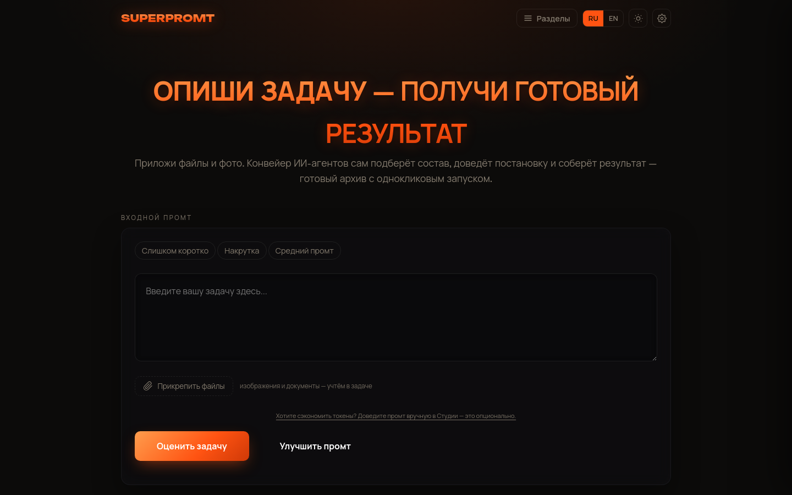
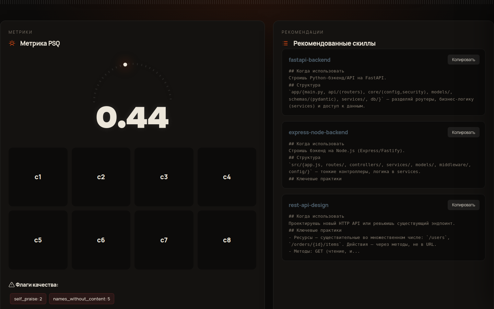
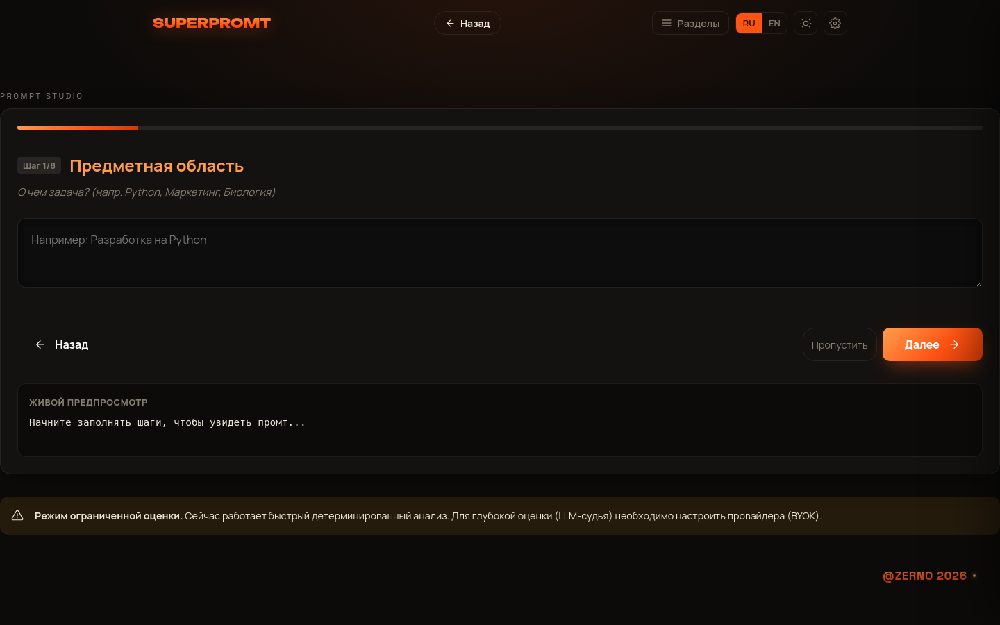
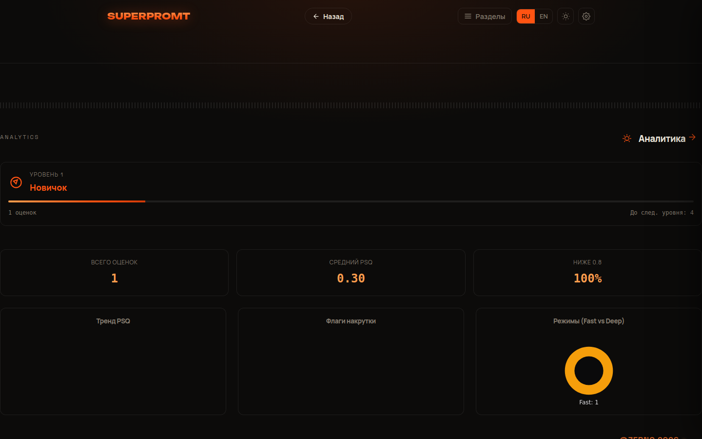
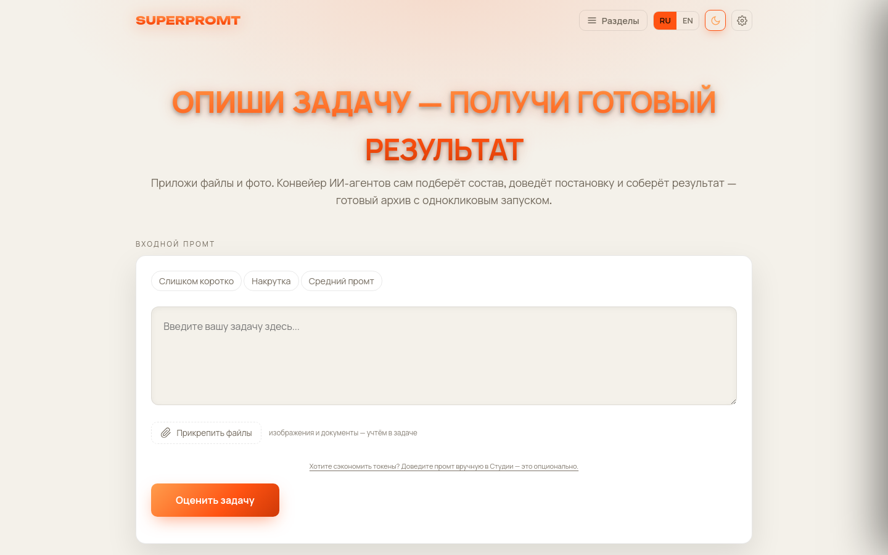
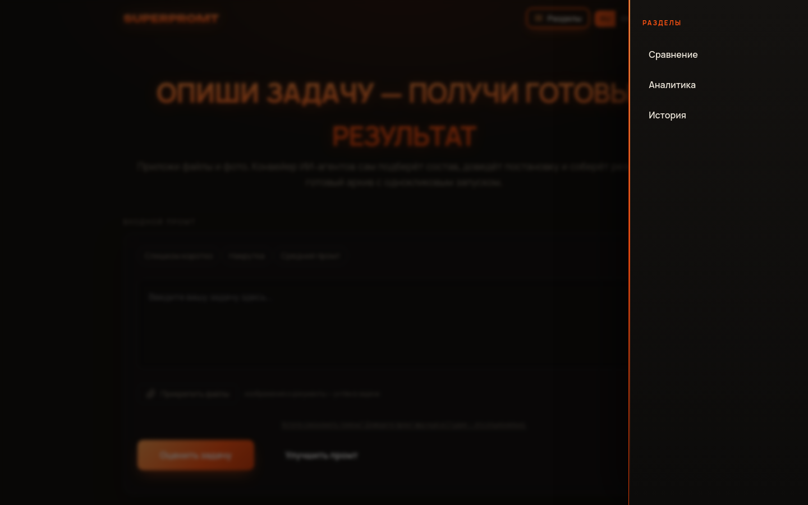

# SuperPromt


**Оценка и улучшение постановки задач для LLM по метрике PSQ + подбор экспертных web/backend-скиллов.**

> 🌐 **Живое демо:** https://html-performance-nails-delays.trycloudflare.com (демо-стенд; детерминированная оценка работает без ключа)

### Новые возможности:
- **Студия**: Полноценная среда для итеративной разработки промптов.
- **Сравнение**: Параллельное тестирование различных версий и моделей.
- **Аналитика**: Глубокий анализ ответов и метрики качества.
- **Темы**: Поддержка темной и светлой тем оформления.
- **i18n**: Многоязычный интерфейс.
- **Экспорт**: Выгрузка результатов в различных форматах.
- **Прикрепление файлов**: Поддержка контекста из документов.


Сырая расплывчатая задача → измеримая оценка качества постановки (PSQ), разбор по чеклисту CSP-8,
детекция «накрутки» и подбор релевантных инженерных скиллов. Ядро — CLI-конвейер; поверх него —
веб-приложение (FastAPI + одностраничный фронтенд).

> Разработка веб-слоя ведётся в AI-IDE **Kodik** (агентный цикл, авто-одобрение, проверка в интегрированном
> терминале). Рантайм-провайдер для «глубокой» оценки судьёй — любой OpenAI/Anthropic-совместимый (BYOK).

---

## Скриншоты

| Главный экран | Результат оценки |
|---|---|
|  |  |

| Prompt Studio (коуч CSP-8) | Аналитика |
|---|---|
|  |  |

| Светлая тема | Меню разделов |
|---|---|
|  |  |

---

## Для кого это

- **Разработчики и тимлиды**, которые ставят задачи ИИ-агентам (Kodik, Claude Code, Cursor…) и платят
  за токены: плохая постановка = лишние итерации агентного цикла. PSQ-гейт ловит слабую постановку
  *до* запуска дорогого агента.
- **Промт-инженеры и команды**, которым нужна воспроизводимая, объективная метрика качества постановки
  вместо «на глаз» — с историей, аналитикой и сравнением A/B.
- **Новички**, осваивающие постановку задач: Prompt Studio пошагово учит закрывать все 8 пунктов CSP-8.

Экономика простая: минута в SuperPromt экономит циклы агента (в кредитах/токенах) и даёт предсказуемый
результат с первого прогона. На маркетплейсе Kodik продукт живёт в трёх формах: веб-приложение (Project),
скилл-пак web/backend (Skill) и MCP-сервер — PSQ-гейт прямо внутри IDE.

---

## Стек: языки, подходы и фреймворки

**Языки:** Python 3.10+ (ядро и бэкенд), ванильные HTML/CSS/JS (фронтенд — осознанно без фреймворков).

**Фреймворки и библиотеки:** FastAPI + Uvicorn, Pydantic v2 / pydantic-settings, pytest (+ FastAPI
TestClient), SQLite (stdlib `sqlite3`), Canvas API (дашборд и шеринг-карточки), Docker + docker-compose,
GitHub Actions (CI). Ядро `superprompt_cli` и MCP-сервер — **только стандартная библиотека Python**,
ноль внешних зависимостей.

**Подходы:**
- слоистая архитектура: веб-слой только оборачивает ядро в HTTP, доменная логика не дублируется;
- детерминированный prescreen без LLM (короткие/накрученные постановки отбраковываются бесплатно);
- BYOK: ключ провайдера — только через env, graceful 503 вместо ложного балла;
- офлайн-ранжирование скиллов косинусным TF-IDF — работает без сети;
- security-by-default: rate-limiting, security-заголовки, валидация длины, параметризованный SQL;
- conventional commits, тесты на каждый слой API, MCP-интеграция по stdio JSON-RPC 2.0.

---

## Как использовался Kodik в разработке

Весь веб-слой построен **в AI-IDE Kodik**: агент с планированием и чекпоинтами собирал фичи
(бэкенд-эндпоинты, история, аналитика, Prompt Studio, сравнение A/B, i18n, экспорт), автоподтверждение
правок ускоряло цикл, а проверка шла в интегрированном терминале и встроенном браузере. QA-прогоны —
отдельными задачами агенту. **KodikShield** маскировал секреты (ключи провайдеров, учётные данные)
перед отправкой контекста в облако. Финальный аккорд — MCP-сервер `mcp/`, который приносит PSQ-гейт
и подбор скиллов в сам Kodik (`mcp__superpromt__*`).

---

## Что такое PSQ

**PSQ (Prompt Specification Quality)** — детерминированная метрика качества *постановки* задачи (не результата):

```
PSQ = (Σ cᵢ / 8) · (1 − 0.5·a)
```

- `cᵢ ∈ {0,1}` — закрыт ли i-й пункт чеклиста **CSP-8** конкретным проверяемым содержанием
  (предметная область, целевая операция, формат выхода, критерии качества, контекстные якоря, роль,
  пример/few-shot, язык);
- `a ∈ [0,1]` — двусмысленность;
- порог «идеальной» постановки — **0.80**.

**Анти-накрутка (watchdog).** Плейсхолдеры, самохвала («эксперт мирового уровня») и тавтологии
(«формат: соблюдён») не засчитываются и снижают балл. Детерминированный `prescreen` отбраковывает
заведомо плохие/накрученные постановки **без обращения к LLM** — это же делает веб-приложение
работоспособным даже без ключа провайдера.

---

## Архитектура

```
superpromt-launchpad/
├── superprompt_cli/     # Ядро: конвейер Router → PSQ-гейт → агентный цикл → паспорт
│   ├── psq.py           #   расчёт PSQ (score/prescreen), watchdog
│   ├── router.py        #   классификация домена задачи + подбор скиллов
│   ├── webskills.py     #   офлайн-ранжирование web/backend-скиллов (косинусный TF-IDF)
│   └── psq_watchdog.py  #   детектор «накрутки»
├── skills/              # Курированный пак web/backend-скиллов (SKILL.md)
├── mcp/                 # MCP-сервер: PSQ-гейт и скиллы внутри Kodik/любого MCP-клиента
└── web/                 # Веб-слой поверх ядра
    ├── backend/         #   FastAPI (переиспользует ядро, логику не дублирует)
    │   ├── main.py
    │   ├── test_api.py  #   тесты через FastAPI TestClient
    │   ├── requirements.txt
    │   └── Dockerfile
    ├── frontend/        #   одностраничный ванильный HTML/CSS/JS (тёмная тема)
    ├── docker-compose.yml
    └── PLAN.md
```

Веб-бэкенд **импортирует** модули `superprompt_cli` и **читает** `skills/` — вся доменная логика живёт
в ядре, веб только оборачивает её в HTTP.

---

## Быстрый старт

### Вариант A — локально (venv)

```bash
cd web/backend
python3 -m venv .venv
source .venv/bin/activate
pip install -r requirements.txt
python main.py            # или: uvicorn main:app --host 0.0.0.0 --port 8000
```

Открыть **http://localhost:8000** — фронтенд отдаётся с того же адреса.

### Вариант B — Docker

```bash
cd web
docker compose up --build
```

Контекст сборки — корень репозитория (чтобы в образ попали `superprompt_cli` и `skills`).
Открыть **http://localhost:8000**.

---

## API

| Метод | Путь | Назначение |
|-------|------|-----------|
| `GET`  | `/api/health` | Проверка работоспособности → `{"status":"ok","version":"0.1.0"}` |
| `GET`  | `/api/status` | Статус LLM-провайдера (deep/fast) |
| `POST` | `/api/psq` | Оценка постановки задачи по PSQ |
| `GET`  | `/api/skills?task=…` | Топ релевантных web/backend-скиллов под задачу |
| `GET`  | `/api/history?n=10` | Последние N записей истории |
| `GET`  | `/api/stats` | Агрегированная статистика для дашборда |
| `GET`  | `/api/history/{id}` | Детали одной записи |
| `DELETE`| `/api/history` | Очистить всю историю |
| `GET`  | `/` | Одностраничный фронтенд |

**Пример — оценка постановки:**

```bash
curl -s -X POST http://localhost:8000/api/psq \
  -H 'Content-Type: application/json' \
  -d '{"prompt":"сделай сайт"}'
# {"psq":0.3,"raw_psq":null,"c":[0,0,0,0,0,0,0,0],"a":1.0,
#  "gaming":0.0,"flags":[],"prescreen":"short"}
```

Ответ `/api/psq`: `psq` — итоговый балл; `c` — 8 флагов CSP-8; `a` — двусмысленность;
`gaming` — оценка накрутки; `flags` — сработавшие маркеры `[{name, count}]`;
`prescreen` — путь детерминированной отбраковки (`short`/`watchdog`) или `null` (нужен LLM-судья).

> Для «глубокой» оценки постановок, прошедших pre-скрининг, нужен LLM-провайдер (BYOK).
> Без ключа `/api/psq` честно отвечает `503` вместо ложного балла; детерминированный путь работает всегда.

---

## Настройка LLM-провайдера (BYOK)

Для глубокой оценки промтов (Deep Mode) необходимо настроить API-ключ одного из провайдеров. Если ключ не настроен, система работает в режиме Fast Mode (детерминированный анализ).

### Переменные окружения

Создайте файл `.env` в корне проекта или в `web/backend/` и добавьте один из ключей:

```bash
OPENAI_API_KEY=sk-...
# ИЛИ
ANTHROPIC_API_KEY=sk-ant-...
# ИЛИ
GOOGLE_API_KEY=...
```

Бэкенд автоматически определит наличие ключа и переключится в режим `deep`. Статус можно проверить через эндпоинт `/api/status`.

## Тесты

```bash
cd web/backend
source .venv/bin/activate
pytest test_api.py -q
```

Покрыто: `/api/health`, `/api/skills` (релевантность), `/api/psq` по детерминированному пути
(без обращения к LLM).

---

## Безопасность

В приложении реализованы следующие меры безопасности:

1.  **Rate Limiting**: Ограничение количества запросов с одного IP-адреса (по умолчанию 60 запросов в минуту). Реализовано на скользящем окне.
2.  **Валидация входных данных**: Максимальная длина промта ограничена 5000 символами. Слишком длинные запросы отклоняются с кодом `422 Unprocessable Entity`.
3.  **Security Headers**: Все ответы API включают защитные заголовки:
    - `X-Content-Type-Options: nosniff` — защита от MIME-sniffing.
    - `X-Frame-Options: DENY` — защита от clickjacking.
    - `Referrer-Policy: no-referrer` — минимизация утечки данных в Referer.
    - `Content-Security-Policy` — базовая политика для защиты от XSS.
4.  **CORS Policy**: Список разрешенных источников настраивается через переменную окружения `ALLOWED_ORIGINS`. При использовании wildcard (`*`) передача учетных данных (`credentials`) запрещена.
5.  **SQL Injection Protection**: Все запросы к SQLite в `storage.py` используют параметризацию.

### Настройка безопасности

Вы можете изменить параметры через переменные окружения:
- `RATE_LIMIT_REQUESTS` (дефолт: 60)
- `RATE_LIMIT_WINDOW` (дефолт: 60 секунд)
- `ALLOWED_ORIGINS` (дефолт: `http://localhost:8000,http://127.0.0.1:8000`)

---

## Лицензия

Внутренний конкурсный проект. Ядро распространяется без сторонних исполняемых зависимостей.
